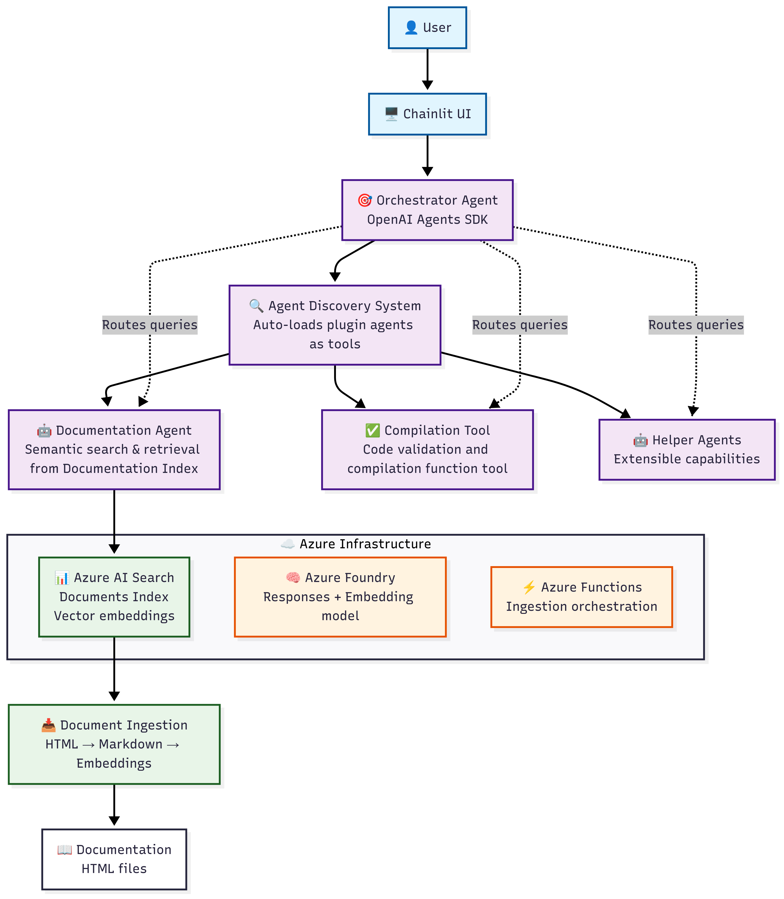

---

layout:  post

title:  "Building an Agentic AI Chatbot that Speaks DSL"

categories:  AI

author:  "Aalok Singh"

---

Over the last few months, I've been deep in the trenches of building agentic AI systems using the  OpenAI Agents SDK. One of the most exciting projects I've worked on was creating a chatbot that takes a user's natural language prompt and outputs  code in a Domain-Specific Language (DSL). Along the way, we combined  retrieval-augmented generation (RAG),  semantic search with Azure AI Search, and a team of specialized agents working under a single orchestrator.

This post shares what I learned from the journey - both the technical architecture and the design decisions that made the system robust.

* * * * *

### What is a DSL?

A  Domain-Specific Language (DSL)  is a mini programming language purpose-built for a narrow domain. Unlike general-purpose languages like Python or Java, which can implement anything from system software to web apps, DSLs are laser-focused.

Think of SQL for databases, regex for pattern matching, or Terraform's HCL for infrastructure automation. In our case, the DSL defined how certain domain rules and workflows needed to be translated into executable logic.

The key challenge:  users don't like writing DSL directly. They want to describe rules in English and let the AI generate clean, valid DSL code.

The DSL I am working with is a proprietary language developed for a specific purpose within this organization. You can be sure no LLM was trained on this language as nothing about it is available on the open web. This is where a robust RAG system becomes important, as we will see.

* * * * *

### The Core Problem

We needed a chatbot that:

1.  Accepts user prompts in natural language.
2.  Understands the intent and domain context.
3.  Generates  valid, executable DSL code, not just free-form text.
4.  Ensures correctness by consulting external knowledge sources.
5.  Decomposes complex user tasks into smaller, domain-specific steps.

* * * * *

### Garbage In, Garbage Out: Data Preparation Was Critical

Before any agents could work their magic, we had to solve a foundational problem:  the quality of our DSL documentation directly determined the quality of our outputs.

The original DSL documentation was messy - inconsistent formatting, outdated examples, duplicate sections, and mixed terminology. We learned the hard way that  feeding raw, unsanitized data into a vector database produces unreliable retrieval results.

Here's how we prepared the data:

-   Standardization:  We normalized all DSL syntax examples, ensured consistent naming conventions, and removed deprecated constructs.
-   Chunking Strategy:  Large documentation pages were split into logical chunks that represented complete concepts, along with some overlap.
-   Metadata Enrichment:  Each chunk was tagged with metadata like DSL version, concept category, and complexity level to enable filtered retrieval.
-   Deduplication:  We removed redundant examples and consolidated overlapping explanations.

Once sanitized, we generated embeddings using OpenAI's text-embedding-3-large model and ingested them into  Azure AI Search  as our vector database. The lesson:  spend 50% of your effort on data quality - it multiplies your retrieval accuracy exponentially.

* * * * *

### Semantic Reranking: The Secret Weapon

Azure AI Search provided semantic search out of the box, but we went a step further by implementing  semantic reranking.

Here's how it works: when a user query comes in, the system performs two stages of retrieval:

1.  Initial Retrieval (Vector Search):  The query embedding is compared against all document embeddings in the index using cosine similarity. This returns the top 50 candidate chunks.
2.  Semantic Reranking:  Instead of just returning the top results from vector similarity, Azure AI Search's semantic ranker uses a  cross-encoder model  that deeply understands the relationship between the query and each candidate document. It re-ranks the top 50 results based on semantic relevance, not just vector proximity.

Why does this matter? Vector similarity can sometimes retrieve chunks that  *mention*  similar terms but don't actually answer the user's intent. Semantic reranking ensures that the final top 5-10 results are  contextually the most relevant  to what the user is asking.

For example, if a user asks "How do I handle manager approvals in transaction rules?", vector search might return chunks about "manager roles" or "transaction limits" separately. But semantic reranking understands the  *combined intent*  and prioritizes chunks that show the  intersection  of both concepts.

This dramatically reduced hallucinations and improved DSL generation accuracy.

* * * * *

### Why Agents Instead of Just One Model?

A single LLM prompt could, theoretically, output DSL. But real-world usage taught us that:

-   Some user prompts required  retrieving specific domain rules  (from internal documentation).
-   The DSL had  different subdomains, each requiring its own expert logic.
-   Errors in DSL syntax needed specialized correction strategies.

This is where the  agentic approach  shines. Instead of one monolithic LLM call, we built a  [multi-agent system coordinated by an Orchestrator Agent.](https://www.linkedin.com/pulse/building-modular-ai-agents-plugin-architecture-aalok-singh-g6ygf)

* * * * *

### The Architecture

Here's how the system came together:

-   Orchestrator Agent  Uses the OpenAI Agents SDK to route the user's request. It decides whether the query requires retrieval, DSL transformation, or validation. It is given ample context and instructions as system prompt.
-   DSL Experts (Helper Agents)  Each agent is an expert in a  *subset*  of DSL. For example:  *syntax, rules, validation  *and so on.
-   Knowledge Retrieval (RAG + Azure AI Search)  Users often referred to legacy rules, policies, and code snippets. To handle this, I integrated  semantic search in Azure AI Search. The orchestrator first queries the knowledge base for relevant examples with semantic reranking, injects them into context, and passes them to the helper agents.
-   Feedback & Correction Loop  If the generated DSL didn't validate, the Orchestrator Agent would trigger a handoff to the  *Validator Agent*, which corrected and finalized the output.

### Learnings Along the Way

-   Data quality is non-negotiable.  Garbage in, garbage out isn't just a saying---it's reality. Clean, validated, well-chunked documentation made all the difference.
-   Semantic reranking beats pure vector search.  The cross-encoder reranking step eliminated false positives and surfaced truly relevant context.
-   Agent collaboration beats single-shot prompting.  Letting agents specialize made the system  *modular, scalable, and less error-prone.*
-   RAG is not optional in enterprise-grade DSL systems.  When dealing with evolving rules, retrieval ensures correctness over hallucination.
-   Pausing and handoff are powerful.  Using the Agents SDK's ability to pause execution and let another agent take over kept us from "forcing" correctness in a single prompt.